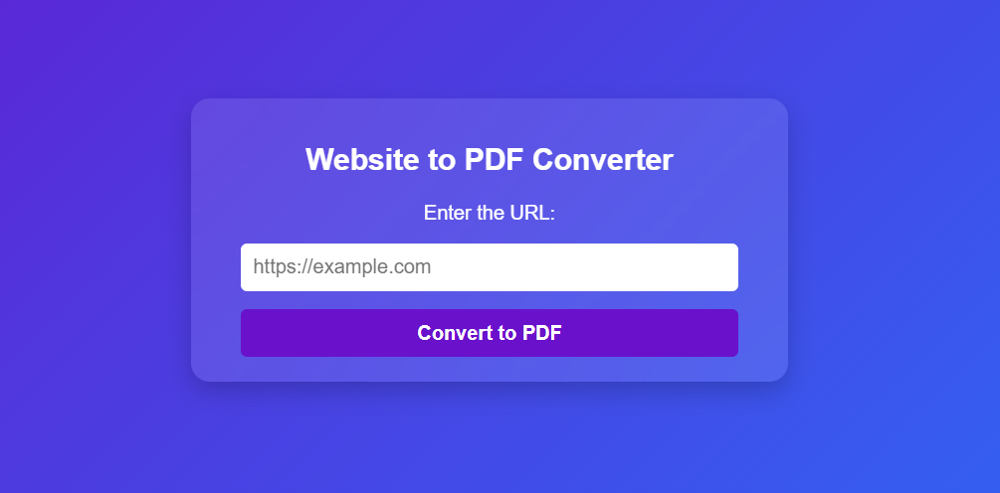

# Website to PDF Converter

This project is a modern web application for converting websites into PDF files. Built using **Node.js**, **Express**, and **Puppeteer**, it provides a sleek and user-friendly interface for generating high-quality PDFs from any given URL. The application is designed with a contemporary look and feel, ensuring a seamless experience.

## Table of Contents
- [ScreenShot](#screenshot)
- [Features](#features)
- [Built With](#built-with)
- [Prerequisites](#prerequisites)
- [Installation and Usage](#installation-and-usage)
- [Environment Variables](#environment-variables)
- [Limitations](#limitations)
- [Contact](#contact)

## ScreenShot



<p align="right">(<a href="#table-of-contents">back to top</a>)</p>

## Features

- **Website to PDF Conversion**: Enter a website URL to generate a downloadable PDF version of the page.
- **Modern Design**: The app features a clean, responsive, and user-friendly design.
- **High-Quality PDFs**: The generated PDFs maintain the design and layout of the original website.
- **Environment Configurations**: Customizable settings using environment variables.

<p align="right">(<a href="#table-of-contents">back to top</a>)</p>

## Built With

This project was built using the following technologies:

* 
* 
* 
* 
* 

<p align="right">(<a href="#table-of-contents">back to top</a>)</p>

## Prerequisites

Before you begin, ensure you have installed the following:

- **Node.js** (version 14.x or higher)
- **npm** (Node Package Manager)

<p align="right">(<a href="#table-of-contents">back to top</a>)</p>

## Installation and Usage

### Step 1: Clone the repository
```bash
git clone https://github.com/AmirrezaAhmadi/Convert-Site-Into-PDF-With-NodeJS.git
cd Convert-Site-Into-PDF-With-NodeJS
```

### Step 2: Install dependencies
```bash
npm install
```
### Step 3: Set up environment variables
1. In the root directory, there is a file named .env.example. Rename this file to .env:
bash
```bash
mv .env.example .env
```
2. Open the .env file and add the required configurations (if any):
```bash
PORT=3000
```
### Step 4: Run the app
```bash
npm start
```
### Step 5: Access the app
Open your browser and go to http://localhost:3000 You can now enter a website URL to generate its PDF.

<p align="right">(<a href="#table-of-contents">back to top</a>)</p>

## Environment Variables
In order to run this project, you need to configure the .env file. The file should look like this:

```bash
PORT=3000
```
<p align="right">(<a href="#table-of-contents">back to top</a>)</p>

## Limitations

Please note the following:

* Not all websites can be converted to PDF due to restrictions or policies enforced by the website itself. Some websites block automated tools like Puppeteer from accessing their content.

*  Ensure that the URL you provide is publicly accessible and does not require authentication.
<p align="right">(<a href="#table-of-contents">back to top</a>)</p>


## Contact

You can reach me through the following:

* Email: AmirrezaAhmadi.GH@Gmail.com
* Telegram: https://t.me/AmirrezaDevelop
* Instagram: https://www.instagram.com/codewithamirreza
* Project Link: https://github.com/AmirrezaAhmadi/Convert-Site-Into-PDF-With-NodeJS.git

<p align="right">(<a href="#table-of-contents">back to top</a>)</p>


